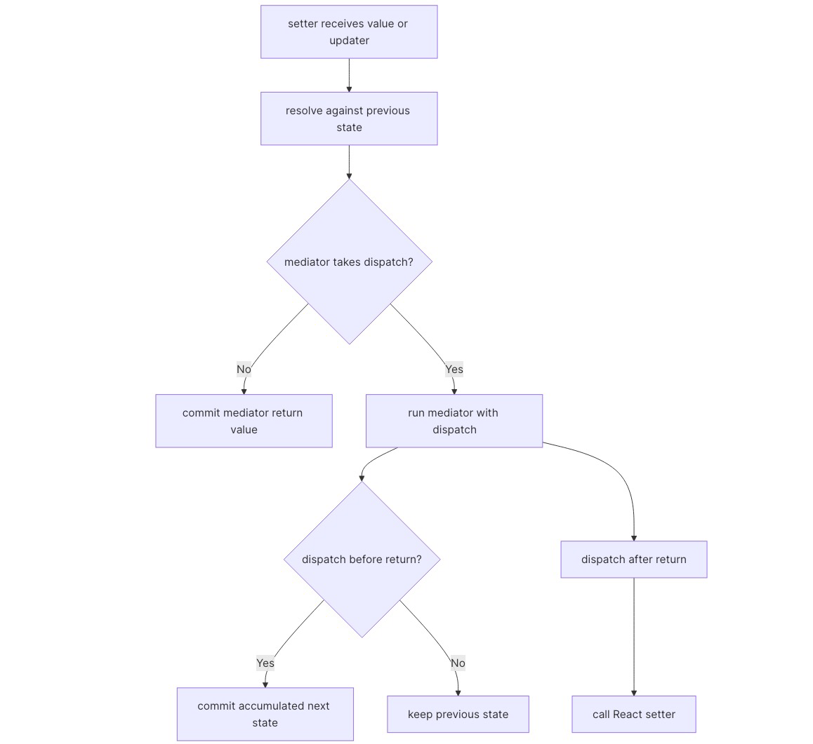

## useMediatedState (Official solution)

`useMediatedState(mediator, initialState)` keeps the tuple shape of `useState`, but routes every requested update through a mediator before React commits it. The subtle part is preserving React setter semantics while supporting two mediator modes: return a transformed value, or call a supplied `dispatch`.

## Solution

This hook is `useState` with a checkpoint in front of the commit:

1.  The caller requests an update with either a value or an updater function.
2.  The hook resolves that request against the latest previous state.
3.  The mediator decides what state, if any, is committed.

React remains the source of truth for the previous state. The mediator can transform or dispatch, but updater functions must still compose like normal `useState` updates.

The returned setter still needs to behave like React's setter. That means updater functions cannot be evaluated eagerly from a stale `state` variable. They have to run inside the functional `setMediatedState()` call, where React provides the latest previous state:

```
function resolveStateAction(action, previousState) {  return action instanceof Function ? action(previousState) : action;}
```

The first mediator is stored in a ref:

```
const mediatorFn = useRef(mediator);
```

This matches the requirement that later `mediator` argument changes should not replace the active mediator. It also lets `setState` be wrapped in `useCallback(..., [])`, so consumers receive a stable setter identity across state updates.

After resolving the requested update into `newState`, the code chooses the mediator mode by arity. A mediator whose `length` is not `2` is treated as a pure transformer and its return value becomes the next state:

```
if (mediator.length !== 2) {  return mediator(newState);}
```

For the dispatch-taking form, the mediator receives `(newState, dispatch)`. If it dispatches immediately, React is already computing the next state, so the hook accumulates those synchronous dispatches into a local `nextState` and returns it. If the mediator dispatches later, the custom `dispatch` falls back to the real React setter.

The mode split looks like this:

| Mediator shape           | Example                                                | State committed by this setter call |
| ------------------------ | ------------------------------------------------------ | ----------------------------------- |
| returns a value          | `(next) => next.trim()`                                | mediator return value               |
| dispatches synchronously | `(next, dispatch) => dispatch(next * 2)`               | accumulated dispatched value        |
| does not dispatch yet    | `(next, dispatch) => setTimeout(() => dispatch(next))` | previous state for now              |



```tsx
import { useCallback, useRef, useState } from 'react';
function resolveStateAction(action, previousState) {  return action instanceof Function ? action(previousState) : action;}
/** * @template T * @param {Function} mediator * @param {T | undefined} initialState */export default function useMediatedState(mediator, initialState) {  // Freeze the mediator so setState doesn't need it in its dependency list.  const mediatorFn = useRef(mediator);  const [state, setMediatedState] = useState(initialState);  const setState = useCallback((newStateOrUpdaterFunction) => {    setMediatedState((previousState) => {      // Resolve updater functions from the latest state, matching React's setter semantics.      const newState = resolveStateAction(        newStateOrUpdaterFunction,        previousState,      );      const mediator = mediatorFn.current;      if (mediator.length !== 2) {        return mediator(newState);      }
      let nextState = previousState;      let didDispatch = false;      let isMediatingSynchronously = true;
      const dispatch = (action) => {        if (!isMediatingSynchronously) {          setMediatedState(action);          return;        }
        didDispatch = true;        nextState = resolveStateAction(action, nextState);      };
      mediator(newState, dispatch);      isMediatingSynchronously = false;
      return didDispatch ? nextState : previousState;    });  }, []);  return [state, setState];}
```

## Common pitfalls

- **Resolving updater functions too early:** Calling an updater with `state` from the render closure can lose batched updates. Resolve value-or-updater actions inside the functional setter so multiple calls like `setState((x) => x + 1)` compose from the latest state.
- **Replacing the mediator after mount:** Adding `mediator` to the setter callback dependencies changes the semantics and may change the setter identity. The problem statement says the mediator should stay the same even if a new function is passed later, so keep the first one in a ref.
- **Treating dispatch mediators like return-value mediators:** A two-argument mediator controls updates by calling `dispatch`. If it does not dispatch synchronously, the previous state should be returned for that setter call. A later asynchronous dispatch should go through React's setter normally.

## Notes

This hook mirrors the tuple shape and setter input forms of `useState`, but every requested update is mediated before it becomes state.

The dispatch function supplied to two-argument mediators accepts the same direct-value and updater-function forms as the returned setter.

Choosing mediator mode by function arity is intentionally part of this prompt's API. It keeps the call site compact, but it also means a two-argument mediator should use `dispatch` instead of returning a value.

That arity split is a prompt-specific tradeoff. A production hook might use an explicit options object to avoid ambiguity, but here it keeps compatibility with the two mediator shapes the tests exercise.
